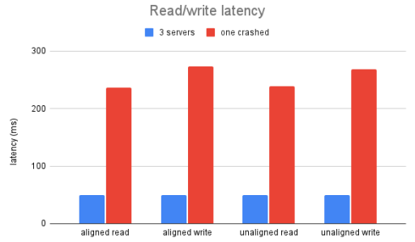
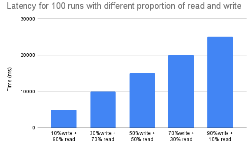
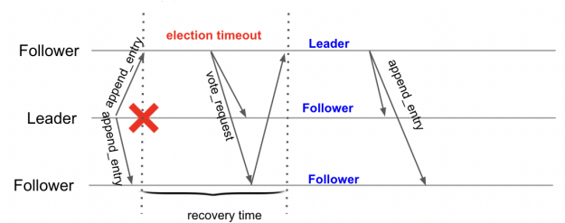
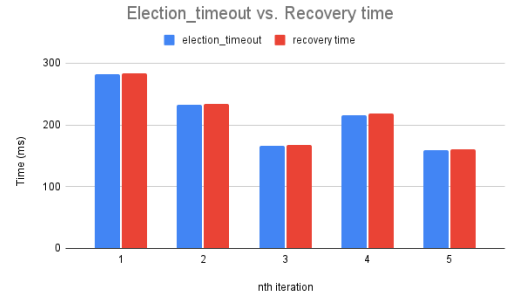

# Project:  Block Storage distributed system with Raft

**Authors:** Shichun Yu (*syu274 AT wisc.edu*), Zhikang Hao and Yuting Yan

## Overview

In this project we implement a replicated block storage service with continuous address space. We built the distributed storage system with the consensus protocol Raft. Base on the paper “In Search of an Understandable Consensus Algorithm (Extended Version)”, we focused on the Figure 2 and implemented the leader election, log replication, safety and client interaction parts.

## Design & Implementation

### Server states

At any time, each server is on one of the three states: leader, follower and candidate, and only one leader can be existed. We build three function for the state chage. A atomic variable ```role``` in server to store the current state. 

* ```void toFollower(int term)```

  When a server changes to be a follower, the ```role``` and ```currentTerm``` are updated and ```voteFor``` is set to -1. Also, the system starts the clock to check follower’s election timeout. Once the  follower receives no communication over a period of time ```ELECTION_TIMEOUT```, it transfer to candidate.

* ```void toCandidate()```

​	To be a candidate, a follower increments its current term and transitions to candidate state. Then 	start the election process, and sent the RequestVote RPCs in parallel to each of the other servers 	in the cluster.

* ```void toLeader()```

  Expect for changing the role, the atomic variable ```leadID``` is set to the ID of current server. Reinitialize the ```nextIndex``` and ```matchIndex```, then send initial empty AppendEntries RPCs  (heartbeat) to each server(implemented in ```leaderHeartbeat```).

Once server state change, the persistent state, currentTerm and voteFor, are stored in local disk before the changes are set.

### Log entries design

We design a ```entry``` struct(shown in Figure 1) to store the states and requests. Since the persistent logs will be used for fail recovery, the strcut include the request command, read/write address, write content and the term. We store the log for both read/write request to prevent client from reading stale data.

```
struct entry {
    // 0: read, 1: write
    1: i32 command,
    2: i32 term,   
    3: i64 address,
    4: string content,
}
```

### Leader eletion 

For the leader election, we design a function ```send_request_votes()``` for candidate to send RequestVote RPCs to follower and RPC handler ```request_vote``` for follower to response. We finish the highlight part in the following figure.


* ```void send_request_votes()```

  Once a server is elected to be a candidate, vote for itself, reset election clock ```last_election``` and send RequestVote RPCs to followers. After receive the votes, handle the following cases:

  *  if it receives votes from a majority of the servers in the full cluster for the same

    term, to be leader;

  *  If it receives an AppendEntries RPC from a leader, to be follower;

  * If election timeout, start a new election.


* ```void raft_rpcHandler::request_vote(request_vote_reply& ret, const request_vote_args& requestVote)```

  The PRC receiver should check the term from RPC. If ```term < currentTerm```, return false, set return term as ```currentTerm```. If ```term > currentTerm```, to be follower. If the ```term = currentTerm``` and ```votedFor``` is null or candidateId, and candidate’s log is at least as up-to-date as receiver’s log, grant vote, also set the  ```currentTerm``` as RPC's term.

### Log replication 

Once a leader is elected, it appends the command to its log as a new entry, then started to send AppendEntries RPCs(implemented by function ```send_appending_requests()```) in parallel to each of the other servers to replicate the entry. The RPC handler is implemented in ```append_entries``.

* ```void send_appending_requests()```  

  Since some fileds of appendEntry RPC for each node would change during the comunication, we create an appendEntry array to store them. 

  * If last log index < nextIndex for a follower: send AppendEntries RPC with emepty log entries(heartbeat) (implemented in ```toLeader```)
  * If last log index ≥ nextIndex for a follower: send AppendEntries RPC with log entries starting at nextIndex:
    * if receiver return success, update nextIndex and matchIndex for follower;
    * if receiver return unsuccess due to log inconsistency, decrement nextIndex and retry.

  To handle the problem like one in Figure 8 in the paper,  the leader should find a `N` such that `N > commitIndex`  and a majority of `matchIndex[i] ≥ N` as well as `log[N].term == currentTerm`, 

  and set `commitIndex` to `N`. 

*  ```void raft_rpcHandler::append_entries(append_entries_reply& ret, const append_entries_args& appendEntries) ``` 

  * When a server receive a AppendEntries RPC, first check its state is follower. If the RPC's term is larger than ```currentTerm```, call ```toFollower```, else return false.  
  * Check the  whether the  term in log entry at ```prevLogIndex```whose term matches ```prevLogTerm``` in ```check_prev_entries``` function. If not, return false.
  * Update ```leaderID``` of the server.
  * Handle the log inconsistenty in ```append_logs``` function.
  * If ```leaderCommit > commitIndex```, set commitIndex  as min(leaderCommit, index of last new entry) and update state machine.

  

### Client interaction 

We design two APIs for clients, read and write. A request will be handled until a leader is elected and will be direct to leader if received by a follower. If the leader crashes, client requests will timeout; clients then try again with randomly-chosen servers. Once the the leader received the request, append entry to local log, update nextIndex and matchIndex(implemented in `new_request`). In the function, we will detect the log index for the request. When `lastApplied` is just larger than the index, leader starts to apply the entry to the sate machine and sends the successful reply to client.

To implement exactly once semantics, we create a struct `request` to store the unique client ID and sequence number of the request. 

```
struct request {
    1: i32 clientID,
    2: i64 seqNum,
    3: i64 address,
    4: string content,
}
```

We also create a hash map to record the largest `seqNum` for each client. If the leader receiver a request from a client with less or equal to the largest `seqNum`, it will reject the request to avoid more-than-once semantric. In some cases, leader may crash after committing the log entry but before respond ing to the client, the client will retry the command with a new leader, causing it to be executed a second time. The solution is creating another hash map to record the largest `seqNum`  that has been responsed to the client. For this part, we just finish implementation but didn't test the semantric.

### Latency optimization

We implement a simple optimization to improve the reply latency when handling a large amount of requests. 


In the original version, when having a large amount of requests, the leader has to execute (apply to the state machine) the earilier request, and then execute and reply to the later request, which causes high latency.	However, in the 4K block store, the latency of a later request could be improved a lot if there is no overlap between the request and the earlier ones. “No overlap” means the diffrences of this request address and all eailier write requests’ address are larger than 4K. 


In this “non-overlap” case, the execution results of eailier requests have no impact on the later request. Therefore, there is no need to wait for the eailier requests, the leader could execute this request and reply immediately, and insert the index of this request log to a set. “lastApplied” variable could be updated according to this set to know which logs have been executed.  However, as time is limited, the implementation is not fully tested. 

## Test

### Experiment Setup

We run our experiment on a cluster of 4 nodes on CloudLab, three of which are run as server and another is client.  Each server has two Intel E5-2660 v3 10-core CPUs @ 2.6 GHz and ten 16 GB DDR4 2133 MHz dual rank RDIMMs. The storage device used is a 1.2 TB 10K RPM 6G SAS SFF HDD. Inter-node communication goes through Dual-port Intel X520 10Gb NIC. We measured the round trip time for a single package between any two nodes to be around 1.5 ms. We run our experiments on Ubuntu 18.04 with ext3 filesystem. Shown below are some of our initial experiment results. 

### Performance test

We set the election time out as 150-300 ms and appendEntries RPC interval as 50 ms.

* read/write latency 

We measure the read / write latency by having a single client issuing aligned and unaligned requests to the server in a synchronous manner. The appendEntry interval is set as 50ms. For each case we send the request 100 times and get the average latency over these 100 runs.   There is no much difference for read/write and aligned/unaligned. But if one server is crashed in the process, the latancy will much higher. Initially, client send a request to a random server, it's possible that the crashed one is choosed. This may happen back and forth for some times that increase the communication and output time. Our algorithm didn't handle such a problem. 



We also run a mixed workload with read/write for 100 runs. We vary the write percentage (W) from 10% to 90% with step size 20% in the 100 runs. The result shows that the latency increase as the write proportion increase. The reason may be that write need string copy to the local disk. 

<br/>

<br/>
*  Recovery time

  The image below showes the recovery process. If leader crashed, the follwer with least timeout will first become candidate, then send voteRequest RPC to followers. After receiving majority of votes, it become new leader.

  

  The recovery time is [current time (new leader elected) - current time (the same server receive the last appendEntry RPC)]. We measure the recovery times(the time interval without leader) 5 five times. The results show that the recovery is highly related to the random election time. They are almost the same, which means the leader election  process is pretty fast.

  

### Correctness 
Note we have a function call to compare the log contents showing in terminals
#### Case 1: follower crash

##### Test1

We manually crash a follower server after committing one writing. Perform a new writing and check if the states are up-to-date
Later we recover the crashed follower and check if latest write has been appended to it, and states are applied on it.
Another key point is that the server will not return any result until 2 servers are present and sync their logs
(Leader Completeness)
https://drive.google.com/file/d/12Vgw-9psT6-yqLlIpZGd7ksz3L8s0ioC/view?usp=sharing

#### Case 2: Leader crash

In this case, we are testing if the behavior of raft server after leader crash works as expected.
##### Test2

We manually crash the leader after a write operation is committed.
Then we crash the server and write another string, and see if the write can be committed, which means a new leader is elected
and take the functions and states of crashed leader.
Then we recover the crashed server and write again. The expected result is the latest write has been applied to all servers,
current leader keeps leadership and all servers contain same logs containing all changes from the past.

https://drive.google.com/file/d/1ML2eBNuN-YR-LqaW4SarrI-UY5spd3M-/view?usp=sharing

#### Case 3: Election

##### Test3:

When a crashed leader recovers, it contains the old term.
The expected result is leader becomes the follower with consistent log.

https://drive.google.com/file/d/1Zt9oHVV8RXo8_n3iyGmPs7Qxj7ooGYDh/view?usp=sharing

Test3-1: \
Created log 1: \
node 0: 1124 \
node 1: 112 \
node 2: 11333 \
node 0 becomes the leader

https://drive.google.com/file/d/1VvpLTIezIThuGL4Ow0CS_uJhJnf2c9gD/view?usp=sharing

Test3-2: \
Created log 2: \
node 0: 1111 \
node 1: 111 \
node 2: 11111 \
node 0 or node 2 becomes the leader

https://drive.google.com/file/d/1soTstrRC60g0y9l-dnqNzbnYCKcTt9SQ/view?usp=sharing

#### Case 4: delayed appending packets from old leaders

In our implementation, when an appending packet
when all have log term x and index 2
a delayed packet is sent to first node replicate to
The result shows the delayed packet will not influence the client operation
and replication of nodes without such packet.
The latter writes have been applied to the nodes and the log content are consistent

https://drive.google.com/file/d/1pKsF_4ES8u5UOBeDe0e6gmpFQYzJ3F_X/view?usp=sharing

## Conclusion

We build a distributed block storage system with Raft consensus protocol using thrift as communication tool. The system are implemented by following the Figure 2 in the paper. We focus on the leader election, log replication and client interaction. Except for the basic functions, we implement the exectly once  semantic and an optimization for no-overlaping operations. The performance are evaluated in 3 server nodes(always one leader, two followers). The results show that write latency is larger than read and the a failed node will decrease the performance of system. The recovery time is highly related to server’s election timeout. We learns a lot from the project including the deep understanding of raft, distributed system locking strategy and debuging skills. 

​	